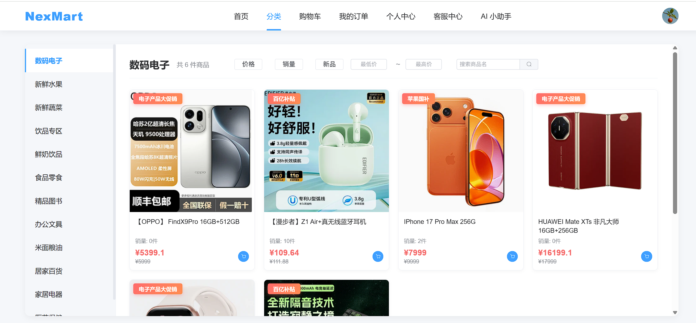
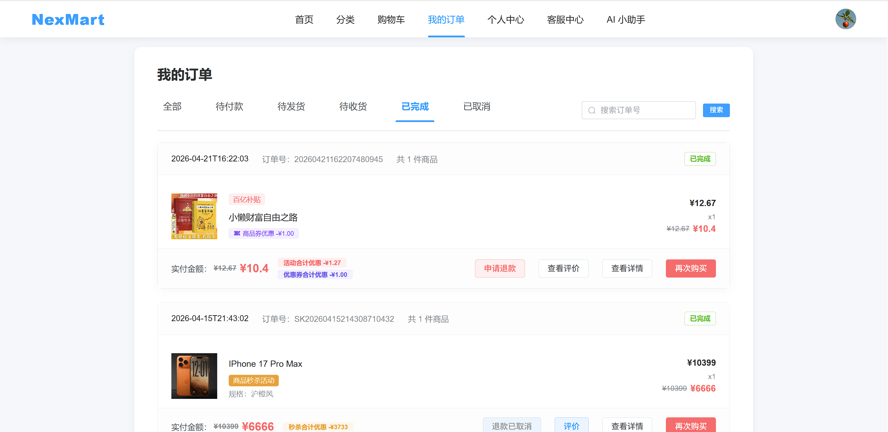
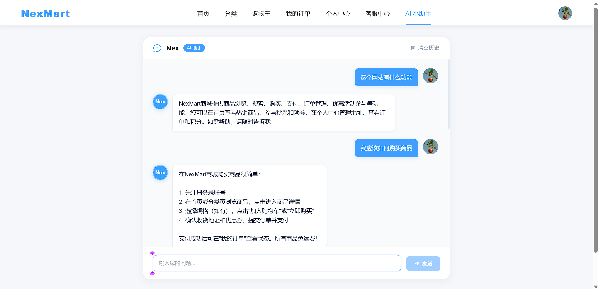
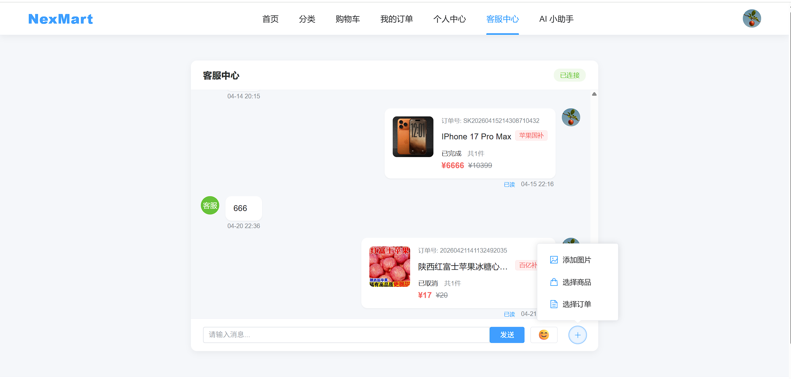
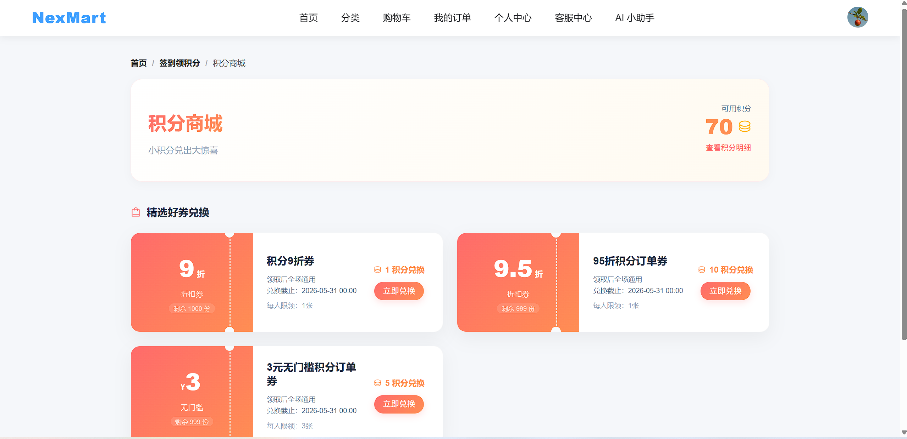
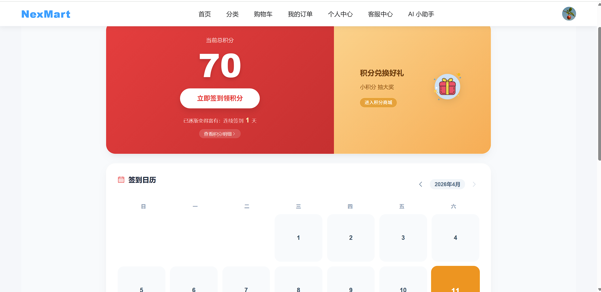
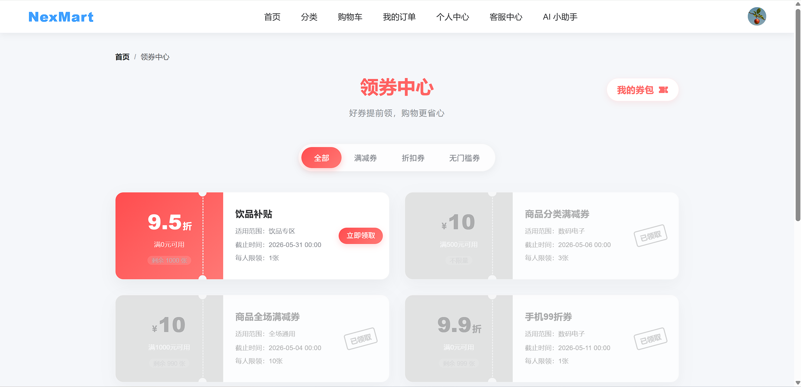
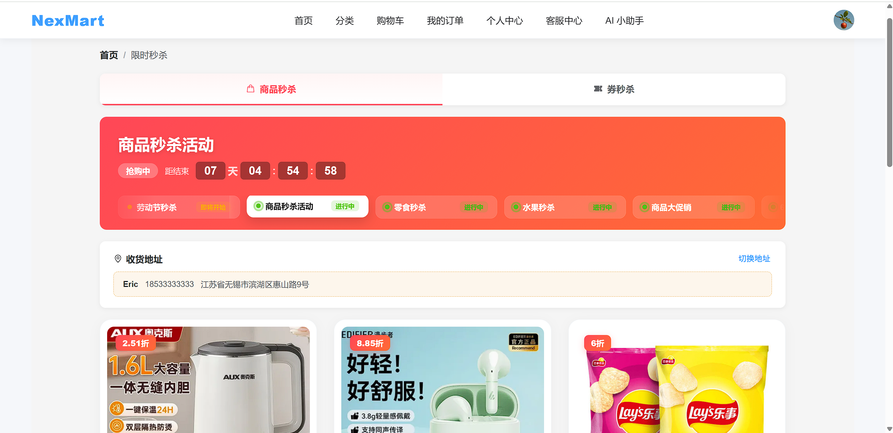
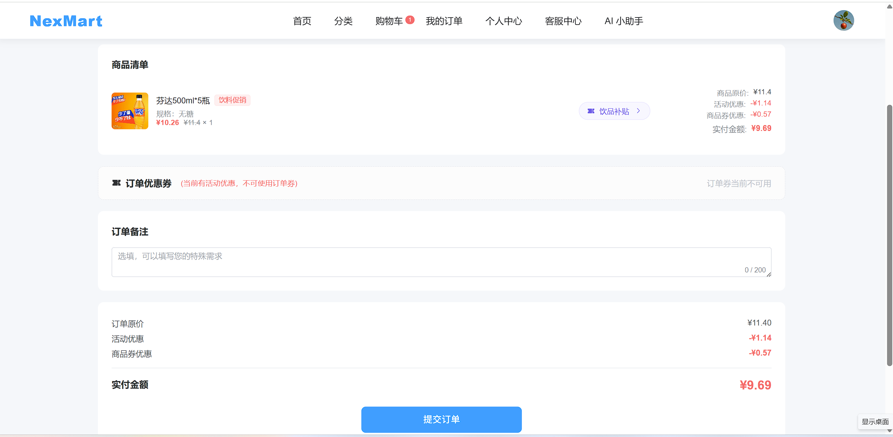

# NexMart 用户端 | NexMart User Frontend

本仓库为 [NexMart 电商平台](https://github.com/EricSu-Dev/NexMart)的用户端前端，基于 Vue 3 + Element Plus 构建。

This is the user-facing frontend of the [NexMart E-Commerce Platform](https://github.com/EricSu-Dev/NexMart), built with Vue 3 + Element Plus.

## 快速启动 | Quick Start

```bash
npm install
npm run dev
```

访问 http://localhost:8085

> 后端仓库及完整文档请见 👉 GitHub：[NexMart](https://github.com/EricSu-Dev/NexMart) | Gitee：[NexMart](https://gitee.com/EricSu-Dev/NexMart)

> 管理端仓库 👉 GitHub：[NexMart-admin](https://github.com/EricSu-Dev/NexMart-admin) | Gitee：[NexMart-admin](https://gitee.com/EricSu-Dev/NexMart-admin)

## 项目截图 | Screenshots











